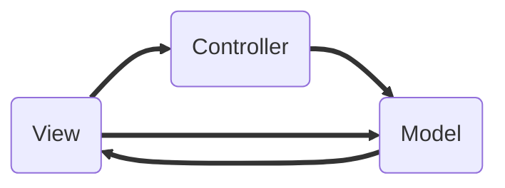
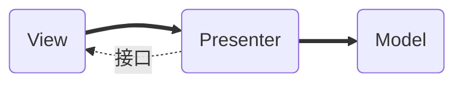

# Android中MVP模式


## 一、简介

MVP 全称：Model-View-Presenter ；MVP 是从经典的模式MVC演变而来，它们的基本思想有相通的地方：Controller/Presenter负责逻辑的处理，Model提供数据，View负责显示。作为一种新的模式，MVP与MVC有着一个重大的区别：在MVP中View并不直接使用Model，它们之间的通信是通过Presenter (MVC中的Controller)来进行的，所有的交互都发生在Presenter内部，而在MVC中View会直接从Model中读取数据而不是通过 Controller。

### 1.1、使用MVP模式优势

* 模型与视图完全分离，我们可以修改视图而不影响模型
* 可以更高效地使用模型，因为所有的交互都发生在一个地方——Presenter内部
* 我们可以将一个Presenter用于多个视图，而不需要改变Presenter的逻辑。这个特性非常的有用，因为视图的变化总是比模型的变化频繁。
* 如果我们把逻辑放在Presenter中，那么我们就可以脱离用户接口来测试这些逻辑（单元测试）


## 二、MVP模式与MVC模式对比

### 2.1、MVC模式


- **Model（数据模型层）**：
  主要负责网络请求、数据库等其它 I/O 操作
- **View（视图层）**：
  主要包括 XML 布局文件（但功能较弱）
- **Controller（控制器层）**：
  一般就是 Activity 或者 Fragment，负责 MVC 整个流程的调度、协作。但是由于 XML 的视图处理能力较弱，需要 Activity 或者 Fragment 承担部分视图层工作。




### 2.2、MVP模式


- **Model（数据模型层）：**
  主要负责网络请求、数据库等其它 I/O 操作，和 MVC 中的 Model 层类似
- **View（视图层）：**
  主要是 Activity、Fragment、XML布局文件
- **Presenter（控制器层）：**
  自定义的 Presenter 类，类似于 MVC 中 Controller 的作用，是 MVP 中的核心，主要负责 Model 层和 View 层的交互



> MVP模式各部分之间的通信都是双向的，View与Model不发生联系，都通过Presenter传递，View非常薄，不部署任何业务逻辑，称为“被动视图”，即没有任何主动性，而Presenter非常厚，所有逻辑都部署在这里。


## 三、Google官方MVP 架构

地址 : https://github.com/googlesamples/android-architecture

| Sample                                                       | Description                                                  |
| ------------------------------------------------------------ | :----------------------------------------------------------- |
| [todo‑mvp](https://github.com/googlesamples/android-architecture/tree/todo-mvp/) | Demonstrates a basic [Model‑View‑Presenter](https://en.wikipedia.org/wiki/Model%E2%80%93view%E2%80%93presenter) (MVP) architecture and provides a foundation on which the other samples are built. This sample also acts as a reference point for comparing and contrasting the other samples in this project. |
| [todo‑mvp‑clean](https://github.com/googlesamples/android-architecture/tree/todo-mvp-clean/) | Uses concepts from [Clean Architecture](https://8thlight.com/blog/uncle-bob/2012/08/13/the-clean-architecture.html). |
| [todo‑mvp‑dagger](https://github.com/googlesamples/android-architecture/tree/todo-mvp-dagger/) | Uses [Dagger 2](https://google.github.io/dagger/) to add support for [dependency injection](https://en.wikipedia.org/wiki/Dependency_injection). |
| [todo‑mvp‑rxjava](https://github.com/googlesamples/android-architecture/tree/todo-mvp-rxjava/) | Uses [RxJava 2](https://github.com/ReactiveX/RxJava) to implement concurrency, and abstract the data layer. |


* todo-mvp：MVP基础架构
* todo-mvp-clean：基于MVP基础架构，引入Clean架构概念
* todo-mvp-dragger：基于MVP基础架构，使用dragger2依赖注入
* todo-mvp-rxjava：基于MVP基础架构，使用RxJava解决数据并发


## 四、MVP实践

### 4.1、基类

#### 4.1.1、BaseModel

数据模型层基类`BaseModel`:创建公用的方法.基类实现了创建时调用、销毁时调用的方法.

```java
public interface BaseModel {
    /**
     * 创建Model时调用
     */
    void onCreateModel();
    /**
     * 取消在子线程中的任务
     */
    void cancelTasks();
}
```

#### 4.1.2、BaseView

`BaseView`用于Activity与控制器层连接,使得控制器实时调用View层方法.

```java
public interface BaseView {
    /**
     * 显示等待层
     *
     * @param str 显示文字
     */
    void showLoading(String str);
    /**
     * 隐藏等待层
     */
    void hideLoading();
    /**
     * 显示Toast
     *
     * @param str 显示文字
     */
    void showToast(String str);
}
```


#### 4.1.3、BasePresenter

`BasePresenter` 控制器基类,用于接收Model对象、View对象,控制View层与Model分离.在销毁时及时清除Model层数据,即调用 **mModel.cancelTasks()** 方法.

```java
public abstract class BasePresenter<M extends BaseModel, V > {

    public M mModel;
    public V mView;
    public WeakReference<V> mViewRef;
    public void attachModelView(M pModel, V pView) {
        mViewRef = new WeakReference<V>(pView);
        this.mModel = pModel;
        this.mView = getView();
        if (null != mModel) {
            mModel.onCreateModel();
        }
    }
    public V getView() {
        if (isAttach()) {
            return mViewRef.get();
        } else {
            return null;
        }
    }
    public boolean isAttach() {
        return null != mViewRef && null != mViewRef.get();
    }
    public void onDettach() {
        if (null != mViewRef) {
            mViewRef.clear();
            mViewRef = null;
        }
        if (null != mModel) {
            mModel.cancelTasks();
        }
    }
}
```


#### 4.1.4、BaseActivity

`BaseActivity`主要创建Presenter和Model,并将Activity生命周期传递给Presenter

```java
abstract class BaseActivity<T extends BasePresenter, M extends BaseModel> extends Activity {
    public T mPresenter;
    private M mModel;
    @Override
    protected void onCreate(Bundle savedInstanceState) {
        super.onCreate(savedInstanceState);
        setContentView(getLayoutResId());
        //内部获取第一个类型参数的真实类型  ，反射new出对象
        mPresenter = CreateUtil.getT(this, 0);
        //内部获取第二个类型参数的真实类型  ，反射new出对象
        mModel = CreateUtil.getT(this, 1);
        //使得P层绑定M层和V层，持有M和V的引用
        mPresenter.attachModelView(mModel, this);
        initView();
    }
    @Override
    protected void onDestroy() {
        super.onDestroy();
        if (null != mPresenter) {
            mPresenter.onDettach();
        }
    }
```


#### 4.1.5、CreateUtil

`CreateUtil`用于创建类使用.

```java
public class CreateUtil {
    public static <T> T getT(Object o, int i) {
        try {
            return ((Class<T>) ((ParameterizedType) (o.getClass().getGenericSuperclass())).getActualTypeArguments()[i]).newInstance();
        } catch (Exception e) {
            e.printStackTrace();
        }
        return null;
    }
}
```
### 4.2、登录模块MVP实现

#### 4.2.1、契约接口

`LoginContract`是一个契约接口，这里约定了 Activity 需要实现的接口、Model数据模型接口、 Presenter 类中需要实现的业务方法：

```java
 public interface LoginContract {
    /**
     * Login 视图操作接口
     */
    interface LoginView extends BaseView {
        /**
         * 登录成功
         *
         * @param loginBean 登录成功实体
         */
        void setLogin(LoginBean loginBean);
    }
    /**
     * Login 数据模型层接口
     */
    interface LoginModel extends BaseModel {
        /**
         * 登录操作
         *
         * @param name        用户名
         * @param password    密码
         * @param mvpListener 监听器
         */
        void requestLogin(String name, String password, MVPListener<LoginBean> mvpListener);
    }
    /**
     * Login 控制层抽象类
     */
    abstract class LoginPresenter extends BasePresenter<LoginModel, LoginView> {

        /**
         * 登录操作
         * @param name     用户名
         * @param password 密码
         */
        abstract void requestLogin(String name, String password);
    }
}
```


#### 4.2.2、Model 层

Model主要负责登录操作,即 `LoginMode`类:

```java
public class LoginMode implements LoginContract.LoginModel {
    @Override
    public void requestLogin(String name, String password, final MVPListener mvpListener) {
        if (TextUtils.isEmpty(name)) {
            if (mvpListener != null) {
                mvpListener.onError("请输入用户名");
            }
            return;
        }
        if (TextUtils.isEmpty(password)) {
            if (mvpListener != null) {
                mvpListener.onError("请输入密码");
            }
            return;
        }
        //模拟登录请求
        new Handler().postDelayed(new Runnable() {
            @Override
            public void run() {
                if (mvpListener != null) {
                    mvpListener.onSuccess(new LoginBean("小明", "0001"));
                }
            }
        }, 3000);
    }

    @Override
    public void onCreateModel() {
        //初始化操作
    }

    @Override
    public void cancelTasks() {
        //取消操作

    }
}
```


#### 4.2.3、Presente 层

`LoginPresenter`层控制页面与数据交互.

```java
class LoginPresenter extends LoginContract.LoginPresenter {
    @Override
    public void requestLogin(String name, String password) {
        if (mView == null) {
            return;
        }
        mView.showLoading("正在请求,请稍后...");
        mModel.requestLogin(name, password, new MVPListener<LoginBean>() {
            @Override
            public void onSuccess(LoginBean bean) {
                mView.hideLoading();
                mView.setLogin(bean);
            }
            @Override
            public void onError(String msg) {
                mView.hideLoading();
                mView.showToast(msg);
            }
        });
    }
}
```


#### 4.2.4、View层

`LoginActivity`即View层,负责页面展示. 等待层、Toast等UI显示.

```java
class LoginActivity extends BaseActivity<LoginPresenter, LoginMode> implements LoginContract.LoginView {
    private EditText etLoginName;
    private EditText etLoginPassword;
    private Button etLoginSubmit;
    private ProgressDialog progressDialog;

    @Override
    public void initView() {
        progressDialog = new ProgressDialog(this);

        etLoginName = (EditText) findViewById(R.id.et_login_name);
        etLoginPassword = (EditText) findViewById(R.id.et_login_password);
        etLoginSubmit = (Button) findViewById(R.id.et_login_submit);

        etLoginSubmit.setOnClickListener(new View.OnClickListener() {
            @Override
            public void onClick(View v) {
                if(mPresenter!=null){
                    mPresenter.requestLogin(etLoginName.getText().toString().trim(),etLoginPassword.getText().toString().trim());
                }
            }
        });
    }

    @Override
    public int getLayoutResId() {
        return R.layout.activity_login;
    }


    @Override
    public void showLoading(String str) {
        if (!progressDialog.isShowing()) {
            progressDialog.setCancelable(false);
            progressDialog.setCanceledOnTouchOutside(false);
            progressDialog.setMessage(str);
            progressDialog.show();
        }
    }

    @Override
    public void hideLoading() {
        if (progressDialog.isShowing()) {
            progressDialog.dismiss();
        }
    }

    @Override
    public void showToast(String str) {
        Toast.makeText(this, str, Toast.LENGTH_SHORT).show();
    }

    @Override
    public void setLogin(LoginBean loginBean) {
        Toast.makeText(this, "登录成功：" + loginBean.toString(), Toast.LENGTH_SHORT).show();
    }
}
```


## 五、总结

* 使用MVP模式,类相比MVC模式会增多,每个页面都会有一个Model(数据模型)、一个Presenter(控制器)、一个Contract(契约接口).
* 在使用MVP模式,需要在页面销毁时,及时清理Model(cancelTasks)、Presenter(onDettach)中数据和对象.
* 公共的模型数据接口,可以抽取成公共模型.
* View层中View接口中方法命名应通用,防止后续业务逻辑修改,需要更改方法名称.
